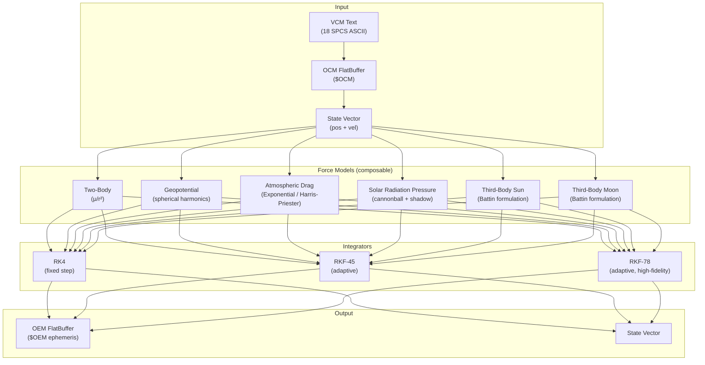
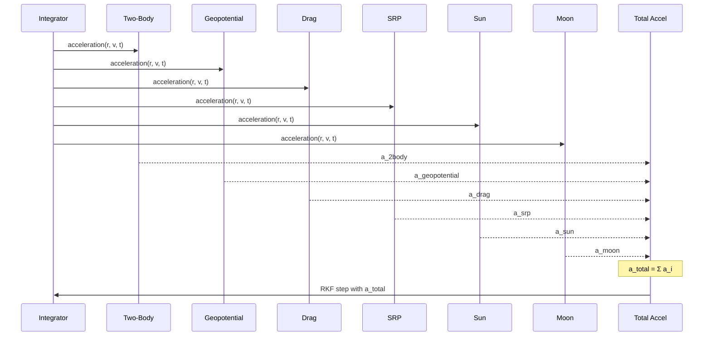

# 🛰️ HPOP — High-Precision Orbit Propagator

[](https://github.com/the-lobsternaut/hpop-sdn-plugin/actions)
[](LICENSE)
[](https://en.cppreference.com/w/cpp/17)
[](wasm/)
[](https://github.com/the-lobsternaut)

**Full-fidelity numerical orbit propagation with composable force models — Cowell's method with adaptive RKF-45/RKF-78 integration, geopotential harmonics, atmospheric drag, SRP, Sun/Moon third-body, and VCM parsing.**

---

## Overview

HPOP is the core numerical propagator for the Space Data Network. It implements Cowell's method (direct integration of the equations of motion) with a full stack of perturbation models:

- **Geopotential** — spherical harmonics (EGM-96/EGM-2008) with Holmes & Featherstone recursion for arbitrary degree/order
- **Atmospheric drag** — exponential, Harris-Priester (with F10.7 diurnal bulge), and pluggable NRLMSISE-00
- **Solar radiation pressure** — cannonball model with cylindrical and conical (penumbra+umbra) shadow functions
- **Third-body** — Sun and Moon via Vallado low-precision analytical ephemerides with Battin's formulation
- **Two-body (Keplerian)** — baseline central force

### Propagation Pipeline

```
VCM text ──→ OCM FlatBuffer ──→ HPOP Propagator ──→ OEM FlatBuffer
  (18 SPCS)   ($OCM schema)    (force models)      ($OEM ephemeris)
```

The plugin also parses 18th Space Control Squadron (18 SPCS) text VCMs into spacedatastandards.org OCM FlatBuffers, and produces OEM FlatBuffer ephemeris output.

---

## Architecture



### Force Model Stack



---

## Data Sources & APIs

| Source | URL | Purpose |
|--------|-----|---------|
| **ICGEM** | [icgem.gfz-potsdam.de](http://icgem.gfz-potsdam.de/) | Gravity model coefficients (EGM-96, EGM-2008) |
| **Space-Track** | [space-track.org](https://www.space-track.org/) | VCM data from 18 SPCS |
| **CelesTrak** | [celestrak.org](https://celestrak.org/) | Space weather (F10.7, Ap) |
| **spacedatastandards.org** | [spacedatastandards.org](https://spacedatastandards.org/) | OCM/OEM FlatBuffer schemas |

---

## Research & References

- Vallado, D. A. (2013). *Fundamentals of Astrodynamics and Applications*, 4th ed. Microcosm Press. Chapters on numerical propagation (Ch. 8), SGP4 (Ch. 9), force models (Ch. 8.6).
- Montenbruck, O. & Gill, E. (2000). *Satellite Orbits: Models, Methods, and Applications*. Springer. Ch. 3 (force models), Ch. 4 (numerical integration), Ch. 3.2 (geopotential).
- Holmes, S. A. & Featherstone, W. E. (2002). ["A unified approach to the Clenshaw summation and the recursive computation of very high degree and order normalised associated Legendre functions"](https://doi.org/10.1007/s00190-002-0216-2). *Journal of Geodesy*, 76(5), 279–299. Stable recursion algorithm for geopotential.
- Harris, I. & Priester, W. (1962). "Time-dependent structure of the upper atmosphere." *Journal of the Atmospheric Sciences*, 19(4), 286–301. Harris-Priester density model.
- Battin, R. H. (1999). *An Introduction to the Mathematics and Methods of Astrodynamics*. AIAA. Battin's formulation for third-body perturbations.
- Storz, M. F. et al. (2005). ["High Accuracy Satellite Drag Model (HASDM)"](https://doi.org/10.2514/6.2005-6386). AIAA 2005-6386. Modern operational drag model.
- Bowman, B. R. et al. (2008). ["A New Empirical Thermospheric Density Model JB2008"](https://doi.org/10.2514/6.2008-6438). AIAA 2008-6438.
- **CCSDS 502.0-B-3** — Orbit Data Messages (ODM). Standard for OCM/OEM formats.

---

## Technical Details

### Integrators

| Integrator | Order | Step Control | Best For |
|-----------|-------|-------------|----------|
| RK4 | 4th | Fixed | Fast propagation, testing |
| **RKF-45** | 4(5) | Adaptive | **Standard operational use** |
| RKF-78 | 7(8) | Adaptive | High-fidelity reference |

Adaptive step control: `h_new = h × min(5, max(0.1, 0.9 × (tol/err)^(1/p)))`

### Geopotential Model

- **Input**: ICGEM GFC format files (EGM-96, EGM-2008)
- **Algorithm**: Fully-normalized Legendre functions via Holmes & Featherstone column recursion
- **Typical truncation**: 21×21 (real-time), 70×70 (high-fidelity), up to 2190×2190 (EGM-2008 full)
- **Frame**: Computation in ECEF body-fixed, rotated to J2000 ECI

### Atmospheric Drag

**Cannonball model**: `a_drag = -½ · ρ · Cd · (A/m) · |v_rel|² · v̂_rel`

| Model | Altitude | Inputs | Accuracy |
|-------|----------|--------|----------|
| Exponential | 0–1000 km | Altitude only | ~50% (order of magnitude) |
| Harris-Priester | 100–1000 km | Altitude, F10.7, local hour | ~15–30% |
| NRLMSISE-00 | 0–1000 km | Full solar/geomagnetic | ~10–15% |

### Solar Radiation Pressure

**Cannonball model**: `a_srp = -ν · P_sun · Cr · (A/m) · (AU/r)² · r̂_sun`

| Shadow Model | Complexity | Description |
|-------------|-----------|-------------|
| None | Trivial | Always sunlit (ν = 1) |
| Cylindrical | Simple | Hard on/off shadow boundary |
| Conical | Full fidelity | Penumbra + umbra via apparent disk overlap |

### Third-Body Perturbations

Battin's formulation avoids numerical cancellation:
```
a = μ₃ × (r₃_sat × q(u) − r_sat / |r₃|³)
q(u) = u × (3 + 3u + u²) / (1 + (1+u)^(3/2))
u = ((r_sat − r₃) · (r_sat − r₃) − 2·r_sat·r₃) / (r₃ · r₃)
```

### VCM → OCM Mapping

| VCM Field | OCM Field |
|-----------|-----------|
| SATELLITE NUMBER | `Metadata.OBJECT_DESIGNATOR` |
| INT. DES. | `Metadata.INTERNATIONAL_DESIGNATOR` |
| J2K POS/VEL | `STATE_DATA` |
| GEOPOTENTIAL | `Perturbations.GRAVITY_MODEL/DEGREE/ORDER` |
| DRAG | `Perturbations.ATMOSPHERIC_MODEL` |
| BALLISTIC COEF | `PhysicalProperties.DRAG_COEFF_NOM` |
| COVARIANCE | `COVARIANCE_DATA` (lower triangular) |

---

## Input/Output Format

### Input

| Format | Schema | Description |
|--------|--------|-------------|
| VCM text | 18 SPCS ASCII | Raw Space Force VCM |
| OCM FlatBuffer | `$OCM` | spacedatastandards.org OCM |
| JSON | Same fields | OCM in JSON format |

### Output

| Format | Schema | Description |
|--------|--------|-------------|
| OEM FlatBuffer | `$OEM` | Ephemeris output (time-tagged states) |
| State vector | C++ struct | Final position + velocity |

---

## Build Instructions

```bash
git clone --recursive https://github.com/the-lobsternaut/hpop-sdn-plugin.git
cd hpop-sdn-plugin

# Native build
mkdir -p build && cd build
cmake ../src/cpp -DCMAKE_CXX_STANDARD=17
make -j$(nproc)
ctest --output-on-failure

# WASM build
./build.sh

# Node.js test
cd wasm && node test_node.mjs
```

---

## Usage Examples

### Full HPOP Propagation

```cpp
#include "hpop/propagator.h"
#include "hpop/gravity.h"
#include "hpop/atmosphere.h"
#include "hpop/srp.h"
#include "hpop/thirdbody.h"

hpop::Propagator prop;

// Build force model stack
prop.add_force(std::make_unique<hpop::TwoBody>());
prop.add_force(std::make_unique<hpop::GravityField>("egm96.gfc", 21, 21));
prop.add_force(std::make_unique<hpop::HarrisPriester>(150.0)); // F10.7
prop.add_force(std::make_unique<hpop::SRP>(hpop::ShadowModel::CONICAL));
prop.add_force(std::make_unique<hpop::ThirdBodySun>());
prop.add_force(std::make_unique<hpop::ThirdBodyMoon>());

// Spacecraft properties
hpop::SpacecraftProperties sc;
sc.mass_kg = 1000;
sc.drag_area_m2 = 10;
sc.cd = 2.2;
sc.srp_area_m2 = 10;
sc.cr = 1.5;
prop.set_spacecraft(sc);

// Adaptive RKF-45
hpop::PropagatorConfig config;
config.integrator = hpop::IntegratorType::RKF45;
config.abs_tol = 1e-10;
prop.set_config(config);

// Propagate 7 days with 60s output
hpop::State initial = {/* x, y, z, vx, vy, vz in km, km/s */};
std::vector<hpop::EphemerisPoint> ephemeris;
auto final_state = prop.propagate(initial, epoch_jd, epoch_jd + 7.0, 60.0, &ephemeris);
```

### Parse 18 SPCS VCM

```cpp
#include "hpop/vcm_parser.h"

std::string vcm_text = /* raw VCM string */;
auto ocm_flatbuffer = hpop::parse_text_vcm(vcm_text);
// ocm_flatbuffer has $OCM file identifier
```

### WASM (Node.js)

```javascript
import { createHPOP } from './wasm/index.js';

const hpop = await createHPOP();
const result = hpop.propagate({
  state: [7000, 0, 0, 0, 7.5, 0],  // km, km/s
  epoch_jd: 2460000.5,
  duration_days: 7,
  forces: ['twobody', 'j2', 'drag', 'srp', 'sun', 'moon']
});
```

---

## Dependencies

| Dependency | Version | Purpose |
|-----------|---------|---------|
| C++17 compiler | GCC 7+ / Clang 5+ | Core language |
| CMake | ≥ 3.14 | Build system |
| FlatBuffers | Generated | OCM/OEM/VCM schemas |
| Emscripten | Latest | WASM compilation |

---

## Plugin Manifest

```json
{
  "schemaVersion": 1,
  "pluginType": "data-transform",
  "pluginId": "hpop-sdn-plugin",
  "pluginName": "High-Precision Orbit Propagator",
  "pluginVersion": "1.0.0",
  "vendorId": "the-lobsternaut",
  "description": "Parses 18 SPCS text VCM to OCM FlatBuffers, propagates SP orbits with full force model stack, outputs OEM FlatBuffers.",
  "capabilities": ["data.convert", "data.transform", "orbit.propagate"],
  "inputFormats": ["text/vcm", "$OCM"],
  "outputFormats": ["$OEM", "$OCM"]
}
```

---

## Project Structure

```
hpop/
├── plugin-manifest.json
├── build.sh
├── README.md
├── wasm/
│   ├── index.d.ts           # TypeScript definitions
│   ├── test_node.mjs         # Node.js WASM test
│   └── node/
│       └── hpop.wasm
└── src/
    └── cpp/
        ├── CMakeLists.txt
        ├── include/
        │   ├── hpop/
        │   │   ├── state.h           # State vector, constants
        │   │   ├── force_model.h     # ForceModel interface
        │   │   ├── propagator.h      # RK4, RKF-45, RKF-78
        │   │   ├── gravity.h         # Spherical harmonics
        │   │   ├── atmosphere.h      # Exponential, Harris-Priester
        │   │   ├── srp.h             # Solar radiation pressure
        │   │   ├── thirdbody.h       # Sun/Moon (Battin)
        │   │   ├── vcm_parser.h      # Text VCM → OCM
        │   │   ├── vcm_writer.h      # OCM → Text VCM
        │   │   └── vcm_input.h       # VCM FlatBuffer parser
        │   └── sds/
        │       ├── ocm_generated.h   # OCM FlatBuffer schema
        │       └── vcm_generated.h   # VCM FlatBuffer schema
        ├── src/
        │   └── *.cpp
        └── tests/
            └── *.cpp
```

---

## License

MIT — see [LICENSE](LICENSE) for details.

---

*Part of the [Space Data Network](https://github.com/the-lobsternaut) plugin ecosystem.*
